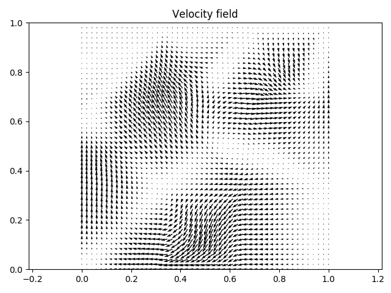

# libcpab
CPAB Transformations [1]: finite-dimensional spaces of simple, fast, and 
highly-expressive diffeomorphisms derived from parametric, 
continuously-defined, velocity fields in **Numpy**, **Tensorflow** and **Pytorch**.

The main idea behind this library is to offer a simple way to use diffiomorphic 
transformations and incorporate them into existing software. The diffiomorphic 
transformations are based on the work of 
[Freifeld et al.](https://www.cs.bgu.ac.il/~orenfr/papers/freifeld_etal_PAMI_2017).
The library supports diffiomorphic transformations in 1D (time series), 
2D (images) and 3D (volumetric images).

This code is based on the original implementation CPAB transformations by
Oren Freifeld (Github repo: [cpabDiffeo](https://github.com/freifeld/cpabDiffeo)).

<p float="center">
  
   
  
</p>

## Author of this software

Nicki Skafte Detlefsen (email: nsde@dtu.dk)

Thanks to Tobias Slott Jensen and Asger Ougaard for suppling the base code 
for the 1D and 3D cases. Thanks to Pola Schwoebel for suppling one of the demos.

This software is released under the MIT License (included with the software). 
Note, however, that using this code (and/or the results of running it) to support
any form of publication (e.g., a book, a journal paper, a conference papar, a patent
application ect.) we request you to cite [1] and [2].

## Requirements

* Generic python packages: numpy, scipy, matplotlib, pickle
* To use the Tensorflow backend, install [tensorflow](https://www.tensorflow.org/install/)
* To use the Pytorch backend, install [pytorch](https://pytorch.org/)

To use the GPU implementation (tensorflow or pytorch backend), you need a nvidia 
GPU and CUDA + cuDNN installed. I recommend going through these 
[installation instructions](https://www.tensorflow.org/install/) for tensorflow. 
If you can get tensorflow working on your machine, pytorch should also work.

## Installation

Clone this reposatory to a directory of your choice
```
git clone https://github.com/SkafteNicki/libcpab
```
Add this directory to your PYTHONPATH
```
export PYTHONPATH=$PYTHONPATH:$YOUR_FOLDER_PATH/libcpab
```

or use the supplied setup script
```
python setup.py install
```

### Note to ensorflow users
To run the fast c++ or cuda version using the tensorflow backend, you probably
need to compile the source files yourself into a dynamic library. The repo only contains
the dynamic library compiled on my own desktop, so there is a good chance it wont
work on yours. After installing the library navigate to ```libcpab/libcpab/tensorflow``` 
folder and type ```make```. This requires you to have a newer version of ```gcc``` and ```nvcc``` installed.

## How to use
The interface is simple to use and only have a couple of different methods that 
should get you started with diffiomorphic transformations. You have the choice 
to choose between a numpy, tensorflow or pytorch backend. Regardless of backend
the main class to interact with is imported as

```
    from libcpab import cpab
    T = cpab(tess_size, backend, device, zero_boundary, volume_perservation)
```

The arguments are:
* tess_size: list, with the number of cells in each dimension
* backend: string, computational backend to use. Choose between "numpy" (default), 
    "pytorch" or "tensorflow"      
* device: string, either "cpu" (default) or "gpu". For the numpy backend only 
    the "cpu" option is valid
* zero_boundary: bool, determines is the velocity at the boundary is zero 
* volume_perservation: bool, determine if the transformation is volume perservating

The class have a number of methods

```
    # Import library
    from libcpab import Cpab
 
    # Define a transformation class
    T = Cpab(tess_size, backend, device, zero_boundary, volume_perservation)
    
    # Important methods
    g = T.uniform_meshgrid(...)               # sample uniform grid of points in transformer domain
    theta = T.sample_transformation(...)      # sample random normal transformation vectors
    theta = T.identity(...)                   # get the identity transformation
    dim = T.get_theta_size()                  # get dimensionality of transformation parametrization
    params = T.get_params()                   # get different transformer parameters
    basis = T.get_basis()                     # get the basis for the transformation
    g_t = T.transform_grid(g, theta)          # transform a grid of points using theta
    data_t1 = T.interpolate(data, g_t)        # interpolate some data using the transformed grid
    data_t2 = T.transform_data(data, theta)   # combination of the two last methods
    plot1 = T.visualize_vectorfield(theta)    # visualize the vectorfield of a given parametrization
    plot2 = visualize_tesselation(...)        # visualize the chosen tesselation
```

Additionally we supply two other main classes, a ```CpabSequential``` class that can be used to efficiently
do multiple wraps in a sequential manner and a ```CpabAlignment``` class for easy use of the CPAB-transformations
to do data alignment. 

We supply 4 demo files::
* demo1.py: simple use of the library to transform data
* demo2.py: demonstration of the ```CpabSequential``` class.
* demo3.py: demonstration of the ```CpabAlignment``` class. 
* time_demo.ipyht: a jupyter notebook, that goes through a data analysis case using libcpab

For a specific use of the transformations in a greater context, 
see this [paper](http://www2.compute.dtu.dk/~sohau/papers/cvpr2018/detlefsen_cvpr_2018.pdf)[3] 
and this [github repo](https://github.com/SkafteNicki/ddtn).

## References
```
[1] @article{freifeld2017transformations,
  title={Transformations Based on Continuous Piecewise-Affine Velocity Fields},
  author={Freifeld, Oren and Hauberg, Soren and Batmanghelich, Kayhan and Fisher, John W},
  journal={IEEE Transactions on Pattern Analysis and Machine Intelligence},
  year={2017},
  publisher={IEEE}
}

[2] @misc{detlefsen2018,
  author = {Detlefsen, Nicki S.},
  title = {libcpab},
  year = {2018},
  publisher = {GitHub},
  journal = {GitHub repository},
  howpublished = {\url{https://github.com/SkafteNicki/libcpab}},
}

[3] @article{detlefsen2018transformations,
  title = {Deep Diffeomorphic Transformer Networks},
  author = {Nicki Skafte Detlefsen and Oren Freifeld and S{\o}ren Hauberg},
  journal = {Conference on Computer Vision and Pattern Recognition (CVPR)},
  year={2018},
  publisher={IEEE}
}

```

## Versions

* ----------, Version 2.0 - Major overhaul of the library, many changes
* 05/12/2018, Version 1.5 - Fix the broken 3D pipline
* 15/11/2018, Version 1.4 - Various bugfixes
* 30/10/2018, Version 1.3 - Numpy backend support
* 22/10/2018, Version 1.2 - Various bugfixes
* 28/09/2018, Version 1.1 - Pytorch backend support
* 23/08/2018, Version 1.0 - First working version of libcpab
